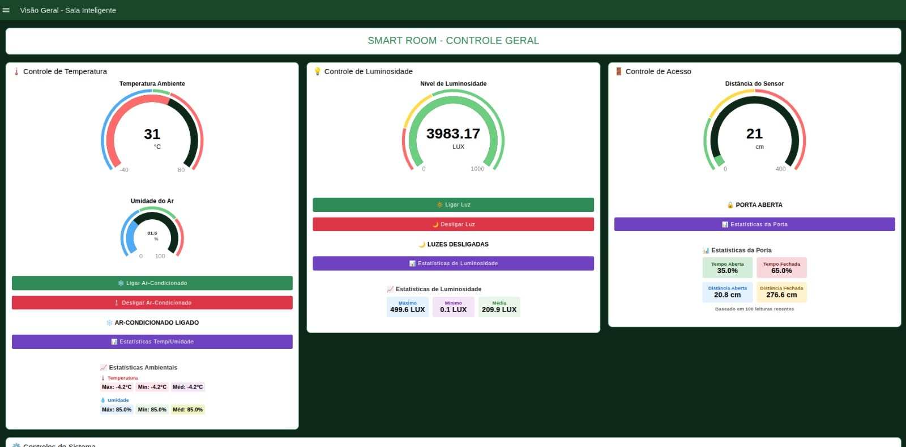

# 🏫 IoT Smart Room – Sala de Aula Inteligente

## 📌 Tema
**Simulação WOKWI (ESP32) + MQTT + Node-RED (usuário)**

## 🧰 Descrição da Atividade
Este projeto tem como objetivo criar um **sistema inteligente para controle de uma sala de aula**, utilizando **dispositivos IoT simulados no WOKWI**, **comunicação MQTT** e um **dashboard interativo no Node-RED**.  
A aplicação demonstra como sensores e atuadores podem ser integrados em tempo real para automatizar e monitorar o ambiente.

---

## ⚙️ Elementos do Sistema

### 1. 💡 Controle de Luminosidade – LDR + LED
- O usuário acompanha a leitura do sensor LDR pelo Node-RED.
- Quando a luminosidade estiver **baixa**, o usuário envia um comando para **acender o LED**.
- Quando a luminosidade estiver **alta**, o usuário envia um comando para **apagar o LED**.

---

### 2. 🌡️ Controle de Temperatura – DHT22 + Relé
- O usuário acompanha a leitura do sensor DHT22 no Node-RED.
- Se a temperatura estiver **alta**, o usuário envia um comando para **ligar o relé**, simulando a ativação de um ar-condicionado.
- Se a temperatura estiver **baixa**, o usuário envia um comando para **desligar o relé**, simulando a desativação do ar-condicionado.

---

### 3. 🚪 Controle de Acesso – Sonar + Servo Motor
- O usuário acompanha a leitura do sonar pelo Node-RED.
- Quando a **distância for próxima**, o sistema **gira automaticamente o servo motor**, simulando a abertura de uma porta.
- Quando a **distância for longa**, o sistema **retorna o servo à posição inicial**, simulando o fechamento da porta.

---

### 4. 📊 Dashboard de Monitoramento – Node-RED
- Dashboard interativo desenvolvido no Node-RED para monitorar todos os sensores e controlar os atuadores em tempo real.
- Layout customizado com cores, indicadores e botões intuitivos.

---

## 📁 Estrutura do Projeto
```
iot-smart-room/
├── README.md # Documentação do projeto
├── nodered/
│ └── sala-inteligente.json # Fluxo Node-RED exportado
└── wokiwi/
└── diagram.json # Circuito simulado no WOKWI

```
---

## 🛠️ Como Usar

### ▶️ 1. Simulação no WOKWI
- Acesse [https://wokwi.com](https://wokwi.com)
- Faça login ou crie uma conta gratuita.
- Crie um novo projeto com **ESP32**.
- Importe o arquivo `wokiwi/circuito-sala-inteligente.json`.
- Clique em **"Start Simulation"** para iniciar.
- Verifique a comunicação MQTT com o Node-RED.

📚 **Bibliotecas necessárias no WOKWI:**
- `Adafruit DHT`
- `Servo.h`
- `WiFi.h`
- `PubSubClient.h`

---

### 🧠 2. Fluxo no Node-RED
- Instale o Node-RED:  
  ```bash
  npm install -g node-red
  node-red

- Acesse o painel: http://localhost:1880

- Importe o fluxo nodered/sala-inteligente.json.

- Ajuste as configurações do broker MQTT se necessário.

- Faça o deploy e visualize o dashboard.
---

## 📸 Demonstrações

### 📊 **Dashboard no Node-RED:**




### 🔌 **Circuito no WOKWI:**


---
## 📚 Tecnologias Utilizadas

- 🧠 **WOKWI** – Simulação de hardware ESP32

- ☁️ **MQTT** – Protocolo de comunicação entre dispositivos

- 🔌 **Node-RED** – Orquestração de dados e criação de dashboard

- 💻 **JavaScript / Node.js** – Ambiente para execução do Node-RED

- ⚙️ **Bibliotecas Arduino** – Controle de sensores e atuadores

---

## ✨ Autores

- **Juliana Ballin Lima** – Universidade do Estado do Amazonas (UEA-EST)
- **Lucas Carvalho dos Santos** – Universidade do Estado do Amazonas (UEA-EST)
